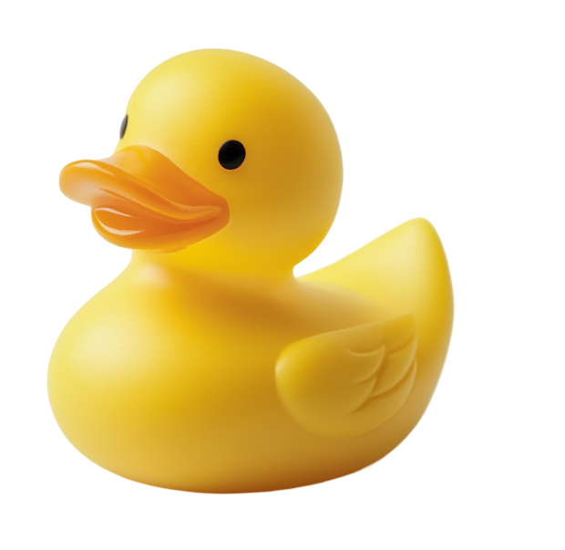

# Магазин уточек — Duck Store
| Магазин продажи уточек, который хочет на сайте продавать уточек онлайн
с доставкой и вести блог для единомышленников|  |
| ------------------------------------------------------------------------------------------------------------------------------------------------------------------------------------------------------------------------------------------------------------------------------- | :---------------------------------------------: |
## Описание

Проект реализует главную страницу с ярким hero section, включающим:<br>- Фоновую фотографию<br>- Крупный заголовок и подзаголовок<br>- CTA-кнопку (призыв к действию)<br>- Поп-ап с формой обратной связи (с маской для телефона)<br>- Адаптивную шапку с навигацией и корзиной 

## Основные компоненты

- **Hero Section** — главный блок с фоном, заголовком, подзаголовком и кнопкой
- **Navbar** — шапка сайта с логотипом, меню, корзиной и кнопкой
- **NavList** — навигационное меню
- **Popup Form** — модальное окно с формой обратной связи
- **Home** — основной контент главной страницы

## Запуск проекта

```bash
npm install
npm run dev
```

---

Проект создан для демонстрации современного подхода к верстке hero section и работы с pop-up без сторонних библиотек.

---
